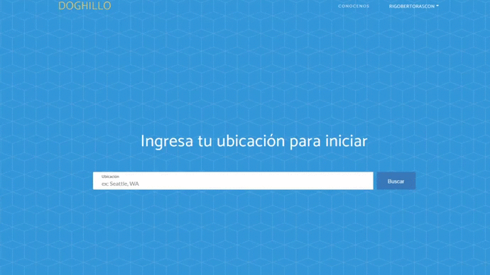
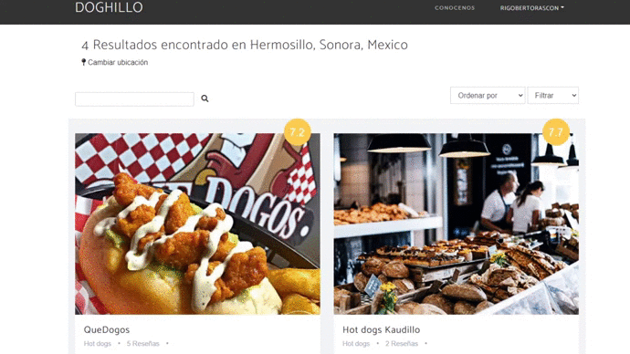
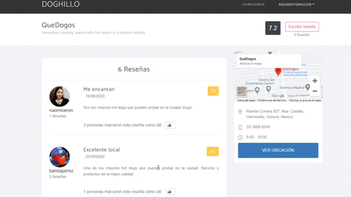

# DOGHILLO

Doghillo es una plataforma de reseñas de puestos de hot dogs y otros negocios locales de alimentos. Su objetivo es crear un ranking de todos los negocios locales de tu ciudad, para que los usuarios descubran las mejores opciones y así apoyar el negocio local.
## Uso
• Ingresa tu ubicación para buscar negocios locales.

• Selecciona el negocio con el que deseas interactuar.

• Lee, califica y escribe reseñas.

## Aportes
Las solicitudes de pull son bienvenidas. Para cambios importantes, abra un problema primero para discutir qué le gustaría cambiar.

Asegúrese de actualizar las pruebas según corresponda.

## License
[Unlicense](https://choosealicense.com/licenses/unlicense/)
